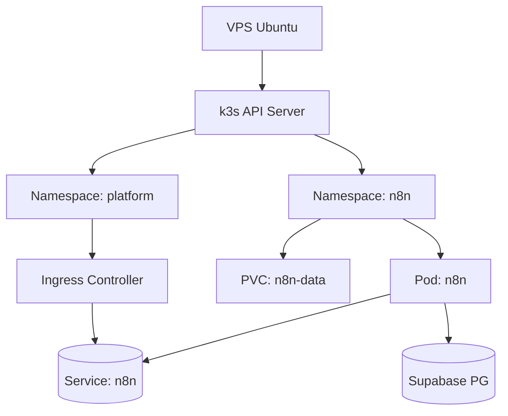
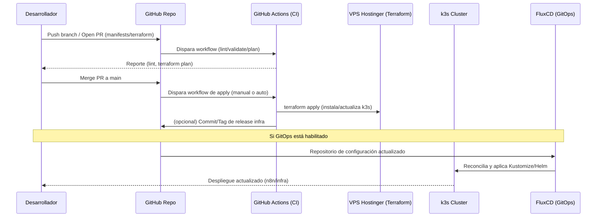

# DIEVOPS Hostinger k3s + n8n — Guía de Inicio

Esta guía explica cómo está organizada la solución, cómo desplegar y operar n8n en el clúster k3s de Hostinger, y cómo introducir cambios de forma segura.

## 1. Arquitectura resumida
- VPS Ubuntu (Hostinger) con k3s (Kubernetes ligero) instalado vía Terraform.
- n8n corre como Deployment en Kubernetes con Service (ClusterIP) y, en producción, Ingress + TLS.
- Base de datos externa (Supabase/PostgreSQL) compartida con instancias previas (no se migran datos si apuntas a la misma DB).
- Secretos gestionados como Kubernetes Secret (para pruebas) o mediante `secretGenerator`/SOPS (recomendado para producción).

### Arquitectura visual (alto nivel)

```mermaid
flowchart LR
  dev[Desarrollador] -->|push/PR| git[(GitHub Repo)]
  git -->|CI (opcional)| gha[GitHub Actions]
  gha -->|Terraform apply| vps[VPS Hostinger]
  vps --> k3s[(k3s Cluster)]

  subgraph Cluster Kubernetes
    subgraph nsPlatform[Namespace: platform]
      ing[Ingress NGINX]
      cm[cert-manager]
    end
    subgraph nsN8n[Namespace: n8n]
      depn8n[Deployment: n8n]
      svcn8n[Service: n8n]
      pvcn8n[PVC: n8n-data]
    end
  end

  ing --- svcn8n
  depn8n --- pvcn8n
  depn8n -->|DB_*| supabase[(Supabase PostgreSQL)]
  user[Usuario] -->|HTTPS| ing
```



## 2. Repositorio y estructura
```
k8s_VPS/
├── artifacts/                 # kubeconfig generado por Terraform (ignorado en git)
├── clusters/hostinger/
│   ├── n8n/                   # despliegue “completo” (PVC, ConfigMap, Ingress opcional)
│   └── n8n-sandbox/           # despliegue mínimo (namespace, Deployment, Service)
├── docker/n8n/                # alternativa con docker-compose (pruebas locales/VPS)
├── terraform/                 # IaC para instalar k3s y opcionalmente Flux
└── .github/workflows/         # pipeline CI (plan/apply Terraform)
```

Archivos sensibles ignorados por git:
- `artifacts/kubeconfig`
- `clusters/hostinger/n8n/secret.env`
- `docker/n8n/.env`

## 3. Preparación del entorno
- Exporta el kubeconfig (generado por Terraform):
  ```bash
  export KUBECONFIG=/Users/<tu-usuario>/DIEVOPS/REPOS/k8s_VPS/artifacts/kubeconfig
  kubectl get nodes
  ```
- Asegura firewall en VPS: permitir 22 (tu IP), 80/443 (si usas Ingress), denegar resto.

## 4. Despliegue rápido (sandbox con port-forward)
- Aplica el overlay mínimo:
  ```bash
  kubectl apply -k clusters/hostinger/n8n-sandbox
  kubectl get pods -n n8n
  ```
- Conexión local por port-forward:
  ```bash
  kubectl -n n8n port-forward svc/n8n 8081:80
  # Navega: http://localhost:8081
  ```
- Conexión a Supabase:
  ```bash
  # Usa un archivo local (no versionado) con tus variables (DB_*, N8N_ENCRYPTION_KEY, ...)
  kubectl -n n8n create secret generic n8n-secrets \
    --from-env-file=/ruta/a/N8N.env \
    --dry-run=client -o yaml | kubectl apply -f -
  # Inyecta en el Deployment y reinicia
  kubectl -n n8n set env deploy/n8n --from=secret/n8n-secrets --containers=n8n
  kubectl -n n8n set env deploy/n8n N8N_PROTOCOL=http N8N_HOST=localhost WEBHOOK_URL=http://localhost:8081
  kubectl -n n8n rollout restart deploy/n8n && kubectl -n n8n rollout status deploy/n8n
  ```

### Acceso rápido con script (recomendado)

Para simplificar la conexión al clúster y abrir la UI de n8n con port-forward local en `http://localhost:8001`, usa el helper incluido:

```bash
scripts/dev-connect.sh              # establece port-forward a svc/n8n (8001->80)
scripts/dev-connect.sh --open       # además abre el navegador (macOS)
scripts/dev-connect.sh --ssh        # sólo abre sesión SSH al VPS

# Opciones útiles
scripts/dev-connect.sh --namespace n8n \
  --kubeconfig artifacts/kubeconfig \
  --ssh-user root --ssh-host 72.60.140.107 --ssh-port 22
```

El script valida el acceso al API del clúster, crea el namespace si hace falta y reintenta el port-forward en caso de error. 

## 5. Despliegue completo (con PVC/ConfigMap/Ingress)
- Edita dominio en `clusters/hostinger/n8n/configmap.yaml` (N8N_HOST/WEBHOOK_URL) y `ingress.yaml`.
- Crea `clusters/hostinger/n8n/secret.env` con tus credenciales (archivo está .gitignore). Para producción usa SOPS/SealedSecrets.
- Instala `ingress-nginx` y `cert-manager` (si aún no los tienes), y un `ClusterIssuer` de Let’s Encrypt.
- Aplica el overlay completo:
  ```bash
  kubectl apply -k clusters/hostinger/n8n
  kubectl get ingress -n n8n
  # Acceso: https://<tu-dominio>
  ```

## 6. Migración desde Cloud Run/Render
1. Detén temporalmente nuevas ejecuciones en la instancia antigua (escala a 0 o pausa). 
2. Apunta el n8n del clúster a la misma DB de Supabase (DB_* + N8N_ENCRYPTION_KEY igual a la anterior).
3. Importa workflows exportados si lo necesitas (API o UI con `N8N_API_KEY`).
4. Valida workflows críticos y webhooks. 
5. Cambia DNS al Ingress del clúster. Mantén la instancia antigua inactiva unos días y luego elimínala.

## 7. Gestión de secretos
- Pruebas: `kubectl create secret ... --from-env-file=N8N.env` (fuera del repo).
- GitOps recomendado: SOPS + age para cifrar `Secrets` en git, o External Secrets Operator con backend (Vault, GCP SM, etc.).

## 8. Operación y mantenimiento
- Backups: PVC (`/home/node/.n8n`) y snapshots/backups en Supabase. 
- Seguridad: habilita Basic Auth en n8n, restringe con NetworkPolicies el namespace `n8n`, desactiva acceso SSH por contraseña en VPS.
- Observabilidad: por ahora básica (Lens + kubectl). Puedes añadir Prometheus/Grafana más adelante.
- Escalado: añade HPA/PodDisruptionBudget si tu carga crece.

## 9. Cambios y flujo de trabajo
- Edita manifiestos bajo `clusters/hostinger/**`; valida sintaxis (`kubectl kustomize` o `kubeconform` si lo tienes).
- Aplica con `kubectl apply -k ...` en desarrollo. Para producción, usa PRs y (más adelante) FluxCD para GitOps.
- Terraform (k3s): ejecuta `terraform` dentro de `k8s_VPS/terraform`. Considera backend remoto (Terraform Cloud/S3) antes de producción.

## 10. Solución de problemas
- Pod no levanta: `kubectl -n n8n logs deploy/n8n -f` y `kubectl describe pod ...`.
- Conexión DB falla: revisa DB_HOST/USER/PASSWORD/PORT/SSL y reglas de red en Supabase.
- “Editor accesible en dominio antiguo”: ajusta N8N_PROTOCOL/N8N_HOST/WEBHOOK_URL y reinicia el Deployment.
- Port-forward ocupado: usa otro puerto local (8081) o libera 8080.

## 11. Roadmap recomendado
- Migrar secretos a SOPS/SealedSecrets.
- Añadir Ingress + TLS (Let’s Encrypt) definitivo.
- Implementar NetworkPolicies y HPA.
- Bootstrap de Flux para GitOps continuo.

## 12. Secuencia de cambios (PR → CI → apply → GitOps)


